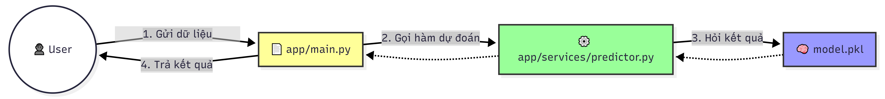
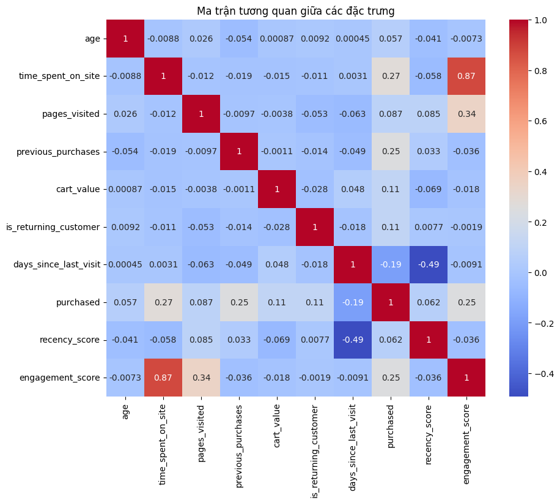

# 🛒 Customer Purchase Prediction API

Dự án này là một hệ thống Machine Learning End-to-End được thiết kế để dự đoán liệu một khách hàng có thực hiện hành vi mua hàng hay không dựa trên các đặc điểm như Độ tuổi (Age) và Thu nhập dự tính (Estimated Salary). 

Dự án bao gồm toàn bộ quy trình từ phân tích dữ liệu (EDA), huấn luyện mô hình (Training) cho đến triển khai dưới dạng API (Inference).

## 🏗 Kiến trúc hệ thống & Luồng xử lý

Dưới đây là sơ đồ minh họa cách thức hệ thống tiếp nhận và xử lý một yêu cầu dự đoán thực tế:


1.  **User Interface**: Người dùng gửi yêu cầu qua REST API.
2.  **API Gateway (`main.py`)**: Tiếp nhận, điều phối và xác thực dữ liệu đầu vào.
3.  **Inference Service (`predictor.py`)**: Chứa logic xử lý, nạp mô hình và thực hiện dự đoán.
4.  **Model Storage (`model.pkl`)**: Lưu trữ mô hình Logistic Regression đã được tối ưu hóa.


### 🔄 Các bước thực hiện:
1. **Gửi dữ liệu (User ➡️ `main.py`)**: Người dùng gửi yêu cầu chứa thông tin khách hàng (ví dụ: Age, Salary) thông qua giao thức HTTP POST tới API được định nghĩa trong `main.py`.
2. **Gọi hàm dự đoán (`main.py` ➡️ `prediction.py`)**: `main.py` nhận dữ liệu, kiểm tra tính hợp lệ và chuyển tiếp yêu cầu đến module xử lý logic `prediction.py`.
3. **Hỏi kết quả (`prediction.py` ➡️ `model.pkl`)**: `prediction.py` thực hiện nạp (load) mô hình Logistic Regression đã được huấn luyện từ file `model.pkl` để đưa ra dự đoán chính xác nhất.
4. **Trả kết quả (`main.py` ➡️ User)**: Kết quả cuối cùng (0 - Không mua, 1 - Mua) được trả về cho người dùng dưới dạng JSON.


## 📊 Phân tích Dữ liệu & Kết quả (Insights & Results)

### Phân tích tương quan
Dựa trên ma trận tương quan, **Age (Tuổi)** và **EstimatedSalary (Thu nhập dự tính)** có tác động trực tiếp và mạnh mẽ nhất đến quyết định mua hàng.



### Hiệu suất mô hình
Mô hình Logistic Regression đạt được độ chính xác cao trên tập kiểm thử, với đường ranh giới phân loại (Decision Boundary) rõ ràng giữa nhóm khách hàng Mua và Không mua.


## 🚀 Hướng dẫn triển khai

### Yêu cầu hệ thống
- Python 3.9+
- Thư viện: `pandas`, `scikit-learn`, `fastapi`, `uvicorn`, `pickle`

### Cài đặt nhanh
```bash
# 1. Clone repository
git clone [https://github.com/vanthanhthien/predicting-customer-behavior.git](https://github.com/vanthanhthien/predicting-customer-behavior.git)
cd predicting-customer-behavior

# 2. Cài đặt thư viện
pip install -r requirements.txt

# 3. Khởi chạy API Server
uvicorn main:app --host 0.0.0.0 --port 8000
